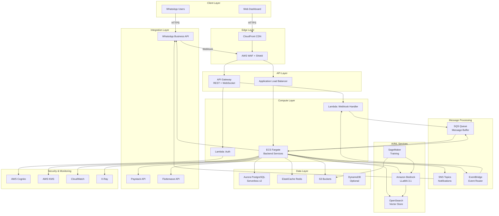

# AWS Architecture - WazAssist AI

## Architecture Diagram (Mermaid)



## AWS Services Breakdown

### 1. Compute Services

#### Amazon ECS Fargate (Primary Backend)
```yaml
Service: wazassist-backend
Launch Type: Fargate
Task Definition:
  CPU: 1 vCPU
  Memory: 2 GB
  Containers:
    - api-service (Port 3000)
    - worker-service (background jobs)
Auto Scaling:
  Min: 2 tasks
  Max: 20 tasks
  Target CPU: 70%
  Target Memory: 80%
Health Check:
  Path: /health
  Interval: 30s
  Timeout: 5s
```

**Cost (Starter)**: ₦15,000-30,000/month
**Cost (Production)**: ₦80,000-150,000/month

#### AWS Lambda (Event-Driven Functions)
```yaml
Functions:
  - webhook-handler:
      Runtime: Node.js 20
      Memory: 512 MB
      Timeout: 30s
      Concurrent: 100
      Trigger: API Gateway

  - auth-handler:
      Runtime: Node.js 20
      Memory: 256 MB
      Timeout: 5s
      Trigger: API Gateway + Cognito

  - invoice-generator:
      Runtime: Node.js 20
      Memory: 1024 MB
      Timeout: 60s
      Trigger: SQS

  - scheduled-reminders:
      Runtime: Node.js 20
      Memory: 512 MB
      Timeout: 300s
      Trigger: EventBridge (cron)
```

**Cost**: ₦5,000-20,000/month (based on invocations)

### 2. API & Networking

#### Amazon API Gateway
```yaml
Type: REST API
Stage: prod
Features:
  - Request validation
  - Rate limiting: 10,000 req/sec
  - API keys for partners
  - Usage plans
  - CORS enabled
Endpoints:
  - POST /webhook/whatsapp
  - POST /auth/login
  - POST /auth/signup
  - GET /api/v1/*
  - POST /api/v1/*
Integration: Lambda + ALB
Security: IAM + Cognito authorizers
```

**Cost**: ₦3,000-15,000/month

#### Application Load Balancer
```yaml
Type: Application Load Balancer
Scheme: Internet-facing
Subnets: 2 public subnets
Target Groups:
  - ECS-Backend (Port 3000)
Health Checks: /health
SSL: ACM Certificate (free)
Access Logs: S3
```

**Cost**: ₦8,000-12,000/month

#### Amazon CloudFront
```yaml
Origin: S3 (frontend) + ALB (API)
Cache Behavior:
  - Static assets: 24 hours
  - API: No cache
  - HTML: 5 minutes
SSL: ACM Certificate
Price Class: Use Only US, Canada, Europe (cheaper)
```

**Cost**: ₦2,000-10,000/month

### 3. Database & Storage

#### Amazon Aurora Serverless v2 (PostgreSQL)
```yaml
Engine: PostgreSQL 15.4
Mode: Serverless v2
ACU Range:
  Starter: 0.5 - 2 ACU
  Production: 1 - 8 ACU
Backup:
  Retention: 7 days
  Snapshot: Daily
  Point-in-time: Enabled
Encryption: KMS
Multi-AZ: Production only
```

**Schema**:
```sql
-- See 03-database-design.md for full schema
Tables:
  - users
  - businesses
  - products
  - orders
  - order_items
  - conversations
  - messages
  - invoices
  - payments
  - analytics
```

**Cost (Starter)**: ₦20,000-40,000/month
**Cost (Production)**: ₦60,000-120,000/month

#### Amazon ElastiCache Redis
```yaml
Engine: Redis 7.0
Node Type:
  Starter: cache.t4g.micro
  Production: cache.r7g.large
Cluster Mode: Disabled (Starter), Enabled (Production)
Replicas: 0 (Starter), 2 (Production)
Use Cases:
  - Session storage
  - Rate limiting counters
  - Product catalog cache
  - Conversation context
TTL Strategy:
  - Sessions: 1 hour
  - Rate limits: 1 minute
  - Catalog: 6 hours
```

**Cost (Starter)**: ₦5,000-10,000/month
**Cost (Production)**: ₦30,000-60,000/month

#### Amazon S3
```yaml
Buckets:
  wazassist-media-prod:
    Purpose: WhatsApp media (images, audio, video)
    Storage Class: S3 Standard → Intelligent-Tiering
    Lifecycle: 90 days → Glacier

  wazassist-invoices-prod:
    Purpose: PDF invoices
    Storage Class: S3 Standard
    Lifecycle: 365 days retention

  wazassist-training-data:
    Purpose: LLM training datasets
    Storage Class: S3 Standard
    Versioning: Enabled

  wazassist-frontend-prod:
    Purpose: React build artifacts
    Storage Class: S3 Standard
    CloudFront: Enabled

  wazassist-backups-prod:
    Purpose: Database backups
    Storage Class: S3 Glacier Instant Retrieval
```

**Cost**: ₦5,000-30,000/month

### 4. AI/ML Services

#### Amazon Bedrock
```yaml
Models:
  - meta.llama3-1-8b-instruct-v1:0
    Cost: $0.0003/1K input tokens, $0.0006/1K output tokens
    Use: Fast responses, simple queries

  - meta.llama3-1-70b-instruct-v1:0
    Cost: $0.00265/1K input tokens, $0.0035/1K output tokens
    Use: Complex reasoning, multi-turn conversations

Optimization:
  - Cache frequent prompts
  - Use 8B model for 80% of queries
  - Route complex queries to 70B
  - Limit context window to 2K tokens avg
```

**Cost (Starter)**: ₦15,000-40,000/month (10K conversations)
**Cost (Production)**: ₦80,000-200,000/month (100K conversations)

#### Amazon SageMaker
```yaml
Purpose: Fine-tune LLaMA for Nigerian context
Instance Type: ml.g5.2xlarge (1 GPU)
Training Frequency: Quarterly
Training Duration: 24-48 hours
Storage: S3
Model Registry: SageMaker Model Registry
Deployment: Bedrock Custom Model Import (future)
```

**Cost**: ₦50,000-100,000 per training job (quarterly)

#### Amazon OpenSearch Serverless
```yaml
Collection: wazassist-vectors
Type: Vector search
Index:
  - products (embeddings)
  - conversations (semantic search)
Embedding Model: amazon.titan-embed-text-v1
Dimensions: 1536
Search Method: k-NN, cosine similarity
```

**Cost (Starter)**: ₦40,000-80,000/month
**Cost (Production)**: ₦100,000-200,000/month

### 5. Messaging & Events

#### Amazon SQS
```yaml
Queues:
  whatsapp-incoming-messages:
    Type: Standard
    Visibility Timeout: 60s
    Retention: 4 days
    DLQ: whatsapp-dlq (after 3 retries)

  invoice-generation:
    Type: Standard
    Visibility Timeout: 120s

  payment-webhooks:
    Type: FIFO
    Deduplication: Content-based

  scheduled-reminders:
    Type: Standard
    Delay: Variable
```

**Cost**: ₦2,000-10,000/month

#### Amazon SNS
```yaml
Topics:
  - order-created
  - payment-received
  - order-shipped
  - low-inventory
  - system-alerts
Subscriptions:
  - Lambda functions
  - SQS queues
  - Email (admins)
  - SMS (critical alerts)
```

**Cost**: ₦1,000-5,000/month

#### Amazon EventBridge
```yaml
Event Bus: wazassist-events
Rules:
  - daily-reminders: cron(0 9 * * ? *)
  - weekly-reports: cron(0 8 ? * MON *)
  - payment-timeout: event pattern match
Targets: Lambda, SQS, SNS
```

**Cost**: ₦500-2,000/month

### 6. Security & Identity

#### AWS Cognito
```yaml
User Pool: wazassist-businesses
Authentication:
  - Username/Password
  - Email verification
  - MFA: Optional (SMS)
  - Password policy: Strong
Token Expiration:
  - Access: 1 hour
  - Refresh: 30 days
Triggers:
  - Pre-signup: Lambda validation
  - Post-confirmation: Lambda onboarding
```

**Cost**: ₦2,000-8,000/month

#### AWS KMS
```yaml
Keys:
  - wazassist-database-key (Aurora encryption)
  - wazassist-s3-key (S3 bucket encryption)
  - wazassist-secrets-key (Secrets Manager)
Rotation: Annual
Usage: Server-side encryption
```

**Cost**: ₦1,500/month per key

#### AWS Secrets Manager
```yaml
Secrets:
  - prod/whatsapp/api-token
  - prod/paystack/secret-key
  - prod/flutterwave/secret-key
  - prod/database/credentials
  - prod/redis/auth-token
Rotation: Automatic (90 days)
```

**Cost**: ₦1,000-3,000/month

### 7. Monitoring & Operations

#### Amazon CloudWatch
```yaml
Metrics:
  - ECS: CPU, Memory, Task count
  - Lambda: Invocations, Duration, Errors
  - Aurora: Connections, CPU, ACU
  - API Gateway: Requests, Latency, 4xx, 5xx
  - Custom: Messages/min, Response time, AI cost

Logs:
  - /aws/ecs/wazassist-backend
  - /aws/lambda/webhook-handler
  - /aws/rds/aurora-postgresql
  Retention: 7 days (Starter), 30 days (Production)

Alarms:
  - High error rate (>1%)
  - High latency (>3s p95)
  - High CPU (>80%)
  - Low disk space (<20%)
  Actions: SNS → Email + SMS
```

**Cost**: ₦5,000-20,000/month

#### AWS X-Ray
```yaml
Services Traced:
  - API Gateway
  - Lambda
  - ECS
  - Aurora
  - Bedrock
Sampling: 10% (Starter), 50% (Production)
Retention: 30 days
```

**Cost**: ₦2,000-8,000/month

### 8. CI/CD & DevOps

#### AWS CodePipeline
```yaml
Pipeline: wazassist-backend-deploy
Stages:
  1. Source: GitHub (main branch)
  2. Build: CodeBuild
  3. Test: CodeBuild (run tests)
  4. Deploy: ECS rolling update
  5. Notify: SNS
Trigger: Git push to main
```

**Cost**: ₦3,000-5,000/month

#### AWS CodeBuild
```yaml
Projects:
  - wazassist-backend-build
  - wazassist-frontend-build
Build Environment:
  Type: Linux
  Image: aws/codebuild/standard:7.0
  Compute: BUILD_GENERAL1_SMALL
Build Spec:
  - Install dependencies
  - Run linter
  - Run tests
  - Build Docker image
  - Push to ECR
```

**Cost**: ₦2,000-8,000/month

#### Amazon ECR
```yaml
Repositories:
  - wazassist-backend
  - wazassist-worker
Image Scanning: On push
Lifecycle Policy: Keep last 10 images
```

**Cost**: ₦500-2,000/month

### 9. Networking Architecture

#### VPC Configuration
```yaml
VPC: wazassist-vpc
CIDR: 10.0.0.0/16
Availability Zones: 2 (eu-west-1a, eu-west-1b)

Subnets:
  Public Subnets:
    - 10.0.1.0/24 (AZ a) - ALB, NAT Gateway
    - 10.0.2.0/24 (AZ b) - ALB, NAT Gateway

  Private Subnets:
    - 10.0.11.0/24 (AZ a) - ECS, Lambda
    - 10.0.12.0/24 (AZ b) - ECS, Lambda

  Database Subnets:
    - 10.0.21.0/24 (AZ a) - Aurora, Redis
    - 10.0.22.0/24 (AZ b) - Aurora, Redis

Internet Gateway: Yes
NAT Gateway: 1 (Starter), 2 (Production)

Security Groups:
  - alb-sg: 80, 443 from 0.0.0.0/0
  - ecs-sg: 3000 from alb-sg
  - db-sg: 5432 from ecs-sg
  - redis-sg: 6379 from ecs-sg
  - lambda-sg: Outbound only

Network ACLs: Default (allow all)
VPC Endpoints:
  - S3 (Gateway)
  - Bedrock (Interface)
  - Secrets Manager (Interface)
```

**Cost**: ₦10,000-25,000/month

## Regional Selection

**Primary Region**: `eu-west-1` (Ireland)
- Closest to Nigeria
- Full service availability
- Lower latency than us-east-1

**Alternative**: `us-east-1` (N. Virginia)
- More services available first
- Slightly higher latency

**Future**: AWS Africa (Cape Town) when Bedrock available

## Cost Breakdown by Tier

### Tier 1: Starter (₦50,000-100,000/month)
| Service | Monthly Cost |
|---------|--------------|
| ECS Fargate (2 tasks) | ₦20,000 |
| Aurora Serverless (0.5-2 ACU) | ₦25,000 |
| Bedrock (10K conversations) | ₦25,000 |
| OpenSearch Serverless | ₦15,000 |
| API Gateway | ₦3,000 |
| S3 + CloudFront | ₦5,000 |
| Redis (t4g.micro) | ₦5,000 |
| Other (Cognito, KMS, etc.) | ₦7,000 |
| **Total** | **₦105,000** |

### Tier 2: Production (₦200,000-500,000/month)
| Service | Monthly Cost |
|---------|--------------|
| ECS Fargate (5-10 tasks) | ₦100,000 |
| Aurora Serverless (2-6 ACU) | ₦80,000 |
| Bedrock (50K conversations) | ₦120,000 |
| OpenSearch Serverless | ₦100,000 |
| API Gateway | ₦10,000 |
| S3 + CloudFront | ₦15,000 |
| Redis (r7g.large) | ₦40,000 |
| NAT Gateway (2) | ₦25,000 |
| Other | ₦20,000 |
| **Total** | **₦510,000** |

### Tier 3: Enterprise (₦1M-2M/month)
| Service | Monthly Cost |
|---------|--------------|
| ECS Fargate (15-30 tasks) | ₦400,000 |
| Aurora Multi-AZ (4-12 ACU) | ₦300,000 |
| Bedrock (200K conversations) | ₦600,000 |
| OpenSearch Provisioned | ₦350,000 |
| API Gateway | ₦30,000 |
| S3 + CloudFront | ₦50,000 |
| Redis Cluster | ₦120,000 |
| NAT Gateway + VPN | ₦40,000 |
| Advanced Monitoring | ₦50,000 |
| Other | ₦60,000 |
| **Total** | **₦2,000,000** |

## Deployment Regions Roadmap

1. **Phase 1**: Single region (eu-west-1)
2. **Phase 2**: Active-passive DR (us-east-1)
3. **Phase 3**: Multi-region active-active
4. **Phase 4**: Edge locations via Lambda@Edge

## Infrastructure as Code (Terraform)

```
infrastructure/terraform/
├── modules/
│   ├── vpc/
│   ├── ecs/
│   ├── rds/
│   ├── opensearch/
│   ├── cognito/
│   └── monitoring/
├── environments/
│   ├── starter/
│   ├── production/
│   └── enterprise/
└── main.tf
```

See [Terraform Guide](../guides/terraform-setup.md) for details.

## Next Steps

1. Review [Database Design](03-database-design.md)
2. Study [LLM Pipeline](04-llm-pipeline.md)
3. Implement [Security Model](05-security.md)
4. Follow [Deployment Guide](../guides/deployment.md)

---

**Document Version**: 1.0
**Last Updated**: December 24, 2025
